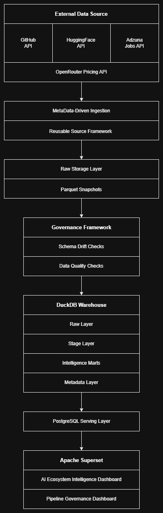
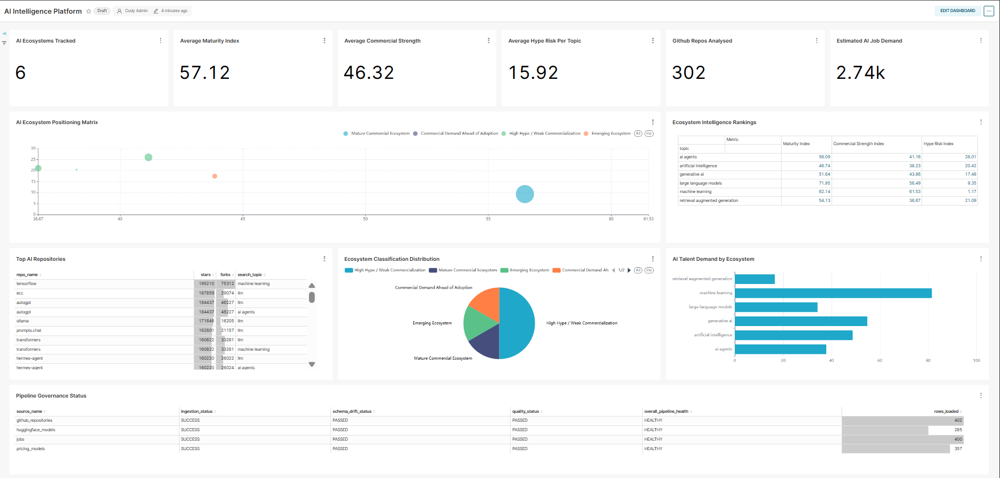
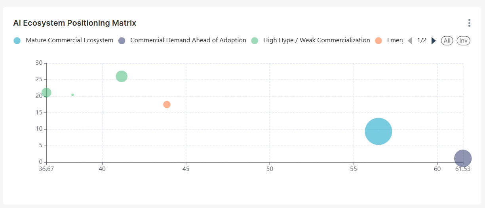
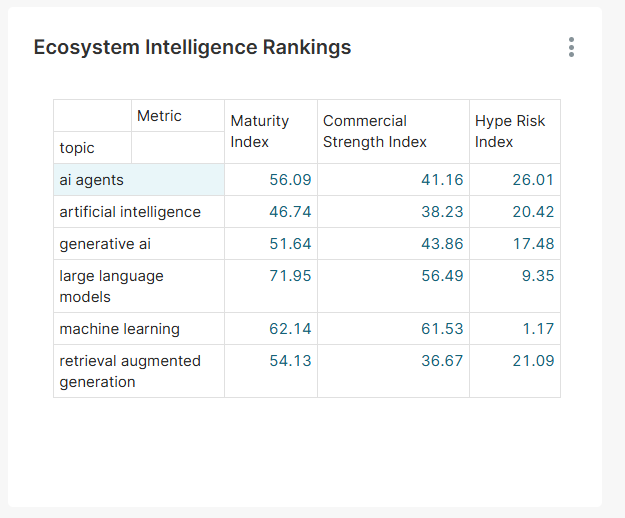
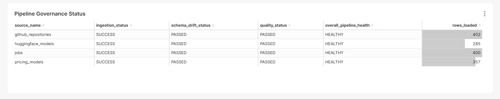

# AI Ecosystem Intelligence Platform

A production-style data platform that ingests, validates, models, and serves intelligence data from multiple AI ecosystem sources.

The platform collects data from GitHub, Hugging Face, AI job markets, and model pricing providers, then processes that data through a governed analytical pipeline consisting of raw storage, schema validation, data quality monitoring, warehouse modelling, semantic marts, and BI serving layers.

The result is a reusable analytics platform that transforms fragmented ecosystem signals into intelligence products such as ecosystem maturity, commercial strength, and hype risk indicators.

---

## What This Project Demonstrates

This project was built to showcase modern analytics engineering and data platform concepts rather than dashboard development alone.

Core concepts demonstrated include:

* Multi-source API ingestion
* Metadata-driven orchestration
* Data contract enforcement
* Raw Parquet persistence
* Schema drift detection
* Data quality frameworks
* DuckDB warehouse architecture
* Stage and mart modelling patterns
* PostgreSQL serving layer design
* Apache Superset analytics delivery
* Cross-source semantic intelligence modelling
* Operational observability and governance

---

## Architecture

The platform follows a layered analytics architecture designed around ingestion, governance, warehouse modelling, and intelligence delivery.



The architecture separates ingestion, governance, modelling, and serving responsibilities to improve maintainability, support additional data sources, and provide operational visibility into pipeline health and data quality.

---

## Dashboard

The platform publishes curated intelligence marts to a PostgreSQL serving layer which are then consumed by Apache Superset dashboards.

The dashboard is built around the flagship intelligence mart:

```text
ai_ecosystem_intelligence
```

which combines open-source activity, model adoption, job market demand, and pricing signals into ecosystem-level intelligence metrics.

### Dashboard Overview



### Intelligence Metrics

The platform generates three primary intelligence indicators:

| Metric                    | Description                                                                                  |
| ------------------------- | -------------------------------------------------------------------------------------------- |
| Ecosystem Maturity Index  | Measures overall ecosystem maturity using adoption, demand, and open-source activity signals |
| Commercial Strength Index | Measures commercial demand and market validation                                             |
| Hype Risk Index           | Measures ecosystem visibility not fully supported by adoption or demand                      |

### Ecosystem Positioning Matrix



The positioning matrix compares ecosystems using maturity and commercial strength indicators to identify emerging opportunities, mature ecosystems, and hype-driven segments.

### Ecosystem Rankings



### Pipeline Governance



Operational governance reporting provides visibility into source health, schema validation, data quality outcomes, and overall pipeline status.

---

## Project Motivation

Many portfolio projects focus primarily on dashboard development or simple API ingestion workflows.

The goal of this project was to explore the engineering systems that support trustworthy analytics at scale.

Rather than building a single dashboard, the project was designed as a small analytical platform with clear separation between ingestion, storage, governance, modelling, serving, and visualization layers.

Key objectives included:

* Building reusable ingestion patterns for multiple APIs
* Persisting raw source data for replayability and auditing
* Detecting schema drift from upstream providers
* Implementing data quality validation frameworks
* Applying warehouse modelling patterns using stage and mart layers
* Separating analytical serving workloads from warehouse processing
* Creating intelligence products from multiple independent data sources

The resulting platform demonstrates concepts commonly found in modern analytics engineering and data platform environments while remaining lightweight enough to run locally using open-source tooling.

---

## Repository Structure

```text
ai-intelligence-platform/

├── assets/          # Architecture diagrams and dashboard screenshots
├── config/          # Platform configuration
├── data/            # Raw, stage, and mart data layers
├── metadata/        # Logging and operational metadata
├── quality/         # Data quality validation framework
├── schema_drift/    # Schema contract monitoring
├── serving/         # PostgreSQL publishing layer
├── sources/         # API ingestion framework
├── storage/         # Raw storage utilities
├── warehouse/       # Warehouse models and orchestration
├── main.py          # Platform entry point
├── Makefile         # Operational commands
├── requirements.txt # Python dependencies
└── README.md        # Project documentation
```

The repository is organized around platform responsibilities rather than individual scripts, making it easier to extend ingestion sources, governance controls, and analytical models independently.

---

## Design Decisions

### Why DuckDB?

DuckDB was selected as the analytical warehouse because it provides a lightweight, local-first OLAP engine that supports modern warehouse concepts such as columnar storage, analytical SQL workloads, and layered modelling patterns.

The goal was to replicate many of the design principles used in cloud data warehouses while keeping the platform simple to run locally.

### Why Raw Parquet Storage?

Raw API responses are persisted as timestamped Parquet snapshots before downstream transformations.

This approach provides:

- Replayability
- Historical auditing
- Recovery from transformation failures
- Protection against upstream API changes

### Why Schema Drift Detection?

External APIs evolve over time and can introduce breaking changes without warning.

Schema contract validation was implemented to detect unexpected structural changes before they propagate into downstream warehouse models and dashboards.

### Why Data Quality Checks?

Data quality validation acts as a governance layer between ingestion and consumption.

Quality checks help identify issues such as:

- Missing values
- Invalid records
- Unexpected row counts
- Source-specific anomalies

before intelligence models are published.

### Why PostgreSQL as a Serving Layer?

DuckDB is used for modelling and warehouse processing while PostgreSQL serves curated datasets to downstream BI workloads.

This separation mirrors common production architectures where analytical processing and dashboard consumption are handled by different systems.

---

## Running Locally

### Setup

```bash
git clone <repository-url>
cd ai-intelligence-platform

python -m venv venv
source venv/bin/activate

pip install -r requirements.txt
```

### Available Commands

The platform uses a Makefile to simplify common operations.

```bash
make run       # Run full pipeline
make init      # Initialize DuckDB metadata tables
make quality   # Run quality checks
make publish   # Publish marts to PostgreSQL
make drift     # Run schema drift checks
make clean     # Remove Python cache files
make reset     # Reset DuckDB database
```

### Run Full Platform

```bash
make run
```

---

## Future Improvements

Potential future enhancements include:

* Automated test coverage for ingestion, transformation, and publishing workflows
* Workflow orchestration using tools such as Airflow or Prefect
* Additional AI ecosystem data sources to expand intelligence coverage
* Historical trend analysis and longitudinal ecosystem tracking
* Automated alerting for schema drift and data quality failures
* Containerized deployment for simplified environment management
* CI/CD pipelines for automated validation and deployment
* Enhanced observability through centralized monitoring and logging

While the current platform is designed for local execution and portfolio demonstration, the architecture was intentionally structured to support future expansion into a more production-oriented analytics platform.
